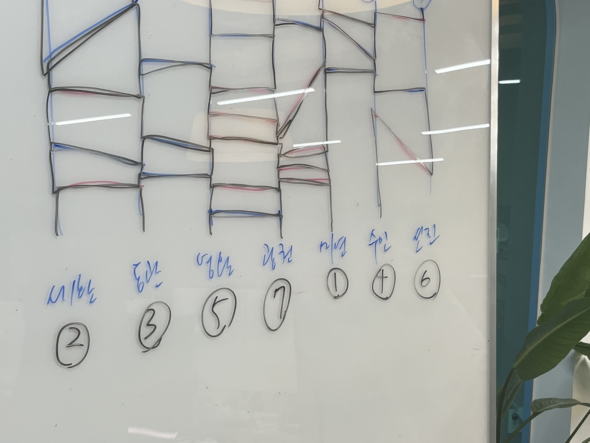
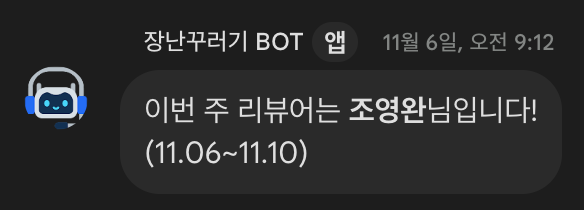

# 코드 리뷰 당번제 도입기

안녕하세요. (주)리체 개발팀 조영완입니다. 이번에 블로그 첫 게시글로 어떤 걸 쓰면 좋을까 고민하다가 개발팀 문화에 대해 소개하는 글이면 좋을 거 같다는 의견이 있었고, 개발팀 문화에는 여러 가지가 있지만 그중에 제가 쓸만한 문화는 뭐가 있을까 고민하다가 다른 회사에는 없을 거 같은 코드 리뷰 당번제에 이야기를 풀어보려고합니다
이 글을 통해 **코드 리뷰 당번제는 왜 도입하게 되었는지**, **어떤 방식으로 운영하는지**, **도입하면서 어떤 문제점이 있었는지**, **도입하고 나서 어떤 점이 좋았는지** 얘기해 보려고 합니다.

우선 우리 팀이 코드 리뷰를 하는 이유에 대해서 간단하게 정리하면 아래와 같습니다

**첫 번째 코드 품질 향상**

개발자라면 모두 공감할 수 있을 것 같은데 동작하는 코드를 구현하는 건 매우 쉬운 일입니다. 하지만 다른 사람들도 쉽게 이해할 수 있고, 유지보수성이 좋은 코드를 만드는 것은 어렵기 때문에 코드 리뷰를 통해 좀 더 읽기 좋고 유지 보수성이 편하도록 여러 가지 피드백을 주고 있습니다. 우리 팀에서 동작한다고 코드 리뷰가 통과 되는 일은 흔치 않은 일입니다

**두 번째 코드의 일관성 유지**

팀을 빌드업하는 단계에서 팀원이 나가는 경우도 있고 새로운 사람이 합류하는 경우도 많아서 프로그래밍 관습을 정하고 규칙을 잘 지키려고 노력하고 있습니다. 새로운 사람이 합류해도 빠르고 안정적으로 팀에 적응할 수 있도록 도와주는 효과가 있다고 생각합니다. 또 기존의 팀원들이 한가지 프로젝트만 하지 않고 여러 가지 프로젝트에 조금씩 기여를 하기 때문에 이때도 그 효과를 볼 수 있습니다.

**세 번째 지식 공유**
해당 도메인에 지식이 부족한 사람이라도 좀 더 지식 있는 팀원의 피드백을 통해 새로운 지식을 습득하고, 새로운 인사이트를 볼 수 있는 기회가 됩니다.
그러므로 팀의 개발 수준을 상향평준화 하는 데 큰 도움이 된다고 생각합니다. 그리고 좀 더 좋은 이름을 추천해 줄 수 있습니다. 개발하다 보면 변수명 이름 짓기가 참 어려울 수 있는데, 변수명에 대해서도 좀 더 좋은 의견이 있으면 피드백할 수 있습니다.

**네 번째 모든 코드의 성과와 책임은 팀의 것**
코드는 리뷰를 통해 팀원들과 함께 만들어 가는 것이기에 성과도 책임도 팀에게 있다고 생각합니다. 간혹 코드에 자신의 자존감 투영하는 사람들이 있는데 우리 팀에서는 이를 지양합니다. 그러므로 좀 더 투명하고 가감 없는 피드백을 통해 높은 수준의 코드가 되어 가고 있습니다.

우리 팀은 자신이 작업한 코드를 팀원들에게 리뷰 받고 서비스에 적용하는 방식으로 운영되고 있습니다. 코드 리뷰 발의자를 제외하고 나머지 팀원들의 승낙을 받으면 서비스에 적용하자고 합의가 됐었는데요. 팀 인원 3명에서 6~7명 정도 증가하면서 모두의 리뷰를 받는 게 불필요한 에너지 낭비다라는 의견이 나와서 토론을 통해 3명한테만 승낙받으면 서비스에 적용하자고 합의가 되었습니다.
한동안 잘 진행되고 있었는데 점차 리뷰 발의자를 제외하고 나머지 팀원들은 **내가 아니어도 누군가 리뷰해주겠지** 생각하면서 리뷰 진행이 안 되는 상황들이 생기기 시작했어요. 그래서 또 이 부분은 어떻게 변경하며 좋을까 토론했고, **리뷰 발의자가 리뷰 받을 3명을 지정**해서 PR을 생성하자고 합의가 되었습니다. 그렇게 잘 진행된다고 느끼던 차에 어느 날 리뷰어로 지정되지 않은 코드 리뷰를 보고 있는데 관련 프로젝트를 진행하는 사람들만 리뷰어로 등록되어 있었고 사소해 보이는 문제점은 좋은 게 좋은 거지 하면서 넘어가는 일들이 많아지는 것 같다고 느껴졌습니다. 이 부분은 또 어떻게 개선하면 좋을까 토론하다 보니까 코드 리뷰에 권한을 가지는 당번을 지정하고 일주일마다 돌아가면서 당번이 되는 것으로 합의가 되었습니다.

**리뷰 당번제는 아래와 같이 진행됩니다.**

- **리뷰 발의자는 리뷰어로 리뷰 당번을 무조건 지정하고 원하는 리뷰어를 1명 지정할 수 있다.**
- **리뷰 당번은 해당 리뷰에 적합한 팀원을 리뷰어로 추가 지정한다.**
- **리뷰 당번은 팀 내에서 진행하는 모든 프로젝트의 PR을 리뷰한다.**
- **리뷰 당번은 순서대로 일주일씩 진행한다.**

이렇게 지정된 리뷰어들의 리뷰를 통과하면 해당 코드가 서비스에 반영될 수 있습니다.

우리 팀은 여러 가지 프로젝트를 진행하고 있습니다. 커머스, 커머스 백오피스, 커머스 공급사 백오피스, 비즈니스용 커머스, 비즈니스용 백오피스, PG 시스템, BNPL 계약시스템, 안드로이드 앱, 제휴사 호스팅, iOS 앱 등등 이외에도 여러 신규 프로젝트까지 여러 가지 언어로 각 서비스 마다 프론트엔드 백엔드까지 분류하면 엄청 다양한데 그러다 보니 대부분의 팀원들이 풀스택 개발자로 일을 하고 있어요, 풀스택 개발자라고 해도 본인이 가장 자신 있는 분야가 있고 주로 담당하는 프로젝트 외에는 잘 모르는 경우도 생기더라고요 그러다 보니 이 PR은 내가 리뷰할 수가 없다는 얘기가 나오기도 했습니다.

그래서 또 토론을 통해 여러 가지 합의점을 도출해 냈습니다.

- **자신이 잘 모르는 프로젝트는 좋은 학습의 기회가 될 것이다.**
- **프로그래밍 언어는 제품을 만들기 위한 도구일 뿐이다. 조언할 부분은 분명히 있을 것이다.**
- **최소한 오타를 찾는것만으로도 코드 리뷰에 기여하는 것이니 리뷰 자체를 무겁게 생각하지 말자**
- **흥미가 없는 분야일 줄 알았는데, 흥미가 생길 수도 있을 것이다.**

실제로 위에 네 가지는 코드 리뷰 당번 제도와 개발자의 역량에 한정되지 않고 리뷰에 참여했을 때 얻을 수 있는 장점이기도 합니다. 이렇게 어떤 문제를 발견하고 토론하고 합의하고를 반복하다 보니까 지금은 안정적으로 잘 정착이 된 거 같습니다. 처음에는 코드 리뷰를 불편해하던 개발자들도 이제는 코드 리뷰 없이 서비스에 코드가 반영되는 게 어색하고 불안하다고 의견이 나오기도 합니다. 최근에 들기 시작한 고민은 팀원이 총 10명이 되기도 했고 팀 내에서 여러 가지 프로젝트를 진행하고 있다 보니까 너무 많은 코드 리뷰가 요청되고 팀원들이 피로도가 증가하여 리뷰 수준이 낮아지거나, 엄청나게 양이 많은 코드 리뷰가 생성되는 것을 어떻게 하면 개선 할 수 있을까 고민하고 있습니다.

리체 개발팀은 문제점을 도출하고 토론하고 합의한 후 새로운 시도를 좋아합니다. 코드 리뷰 외에도 다양한 문화와 재밌는 사연들이 많이 있으니, 블로그에 자주 소개할 수 있도록 하겠습니다.
   

---

 

# 상호 존중 문화

우리 팀은 독특하게도 각기 다른 경험과 세대의 다양성을 보유하고 있습니다.

10대부터 50대까지 다양한 연령대와, 다양한 직장 경험을 가진 팀원들이 함께 일하고 있습니다. 이러한 다양성은 우리 팀을 더욱 풍부하게 만들어주고 있습니다.

나이나 직장 경험에 상관 없이 서로를 존중하고 인정하는 문화를 가지고 있습니다. 이는 일반적인 회사에 자주 나타나는 나이차에 따라 형, 동생으로 부른다든지 반말을 한다든지 하는 문화 배제하고, 모든 팀원이 동등한 입장에서 서로의 의견을 자유롭게 나눌 수 있도록 하고 있습니다.

팀 내에서는 상호 존중과 배려가 우리의 핵심 가치 중 하나입니다. 20년 차 경력자와 신입사원 모두가 서로를 ~님이라고 호칭하고 차이를 존중하며 소통하고, 동등한 입장에서 조언을 나누고 서로의 강점을 존중하고 팀 전체가 함께 성장할 수 있도록 노력하고 있습니다.

이러한 문화는 우리 팀이 더욱 유연하고 창의적으로 일할 수 있는 환경을 조성하고 있습니다. 서로의 다양성을 존중하며 협력하는 것이 우리의 성과를 한층 더 향상시키고 있습니다.
  

---

 
# 데일리 미팅

저희 팀은 아침 11시마다 스크럼을 합니다. 11시가 되면 다들 자연스럽게 칠판 앞에 둥글게 모여서 전날 한 일, 오늘 할 일에 대해서 이야기를 나눠요. 우리만의 특별한 제도는 기분점수 ! 0점부터 10점까지 그 날의 기분 점수를 말합니다. 기분점수와 함께 왜 그런 기분점수가 나왔는지 이야기를 하는데요, 낮은 기분점수가 나온 팀원은 무슨 일이 있구나.. 건들지 말아야겠다! 하기도 하고 위로해 주기도 하지요. 이렇게 저희는 스크럼을 통해서 각 팀원들이 무슨 일을 하고 있는지 알 수 있고, 소소한 잡담으로 그날의 기분을 환기하기도 한답니다.
  

---

 

# Pull Request

  

---

 

# 칸반보드를 활용한 업무 프로세스

  

---

 

# 점심

  

---

 

# 레이드

  

---

 

# 탄력 근무 활용

  

---

 
